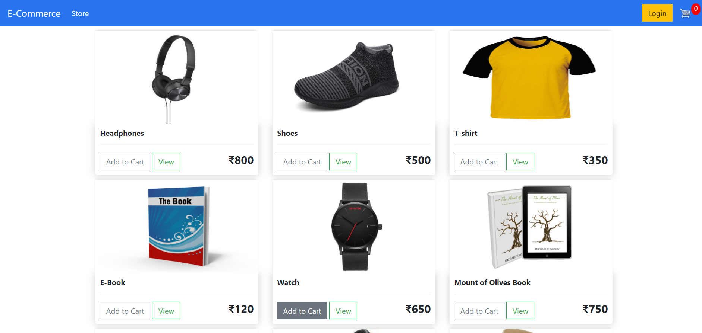
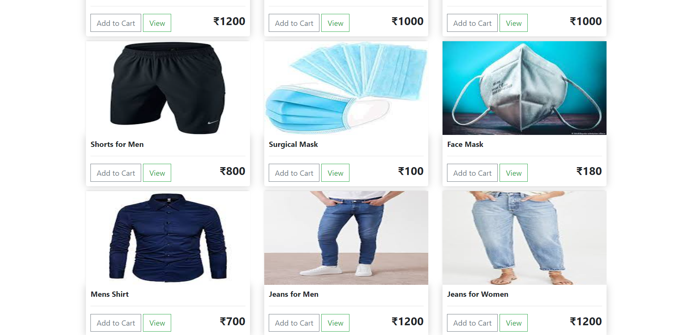
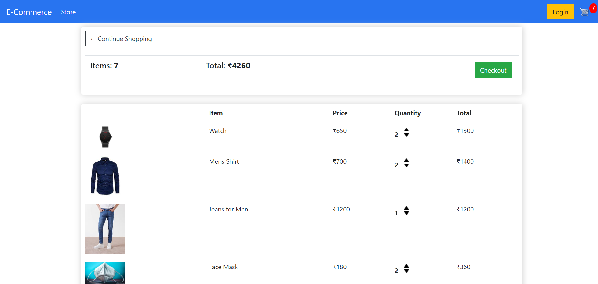
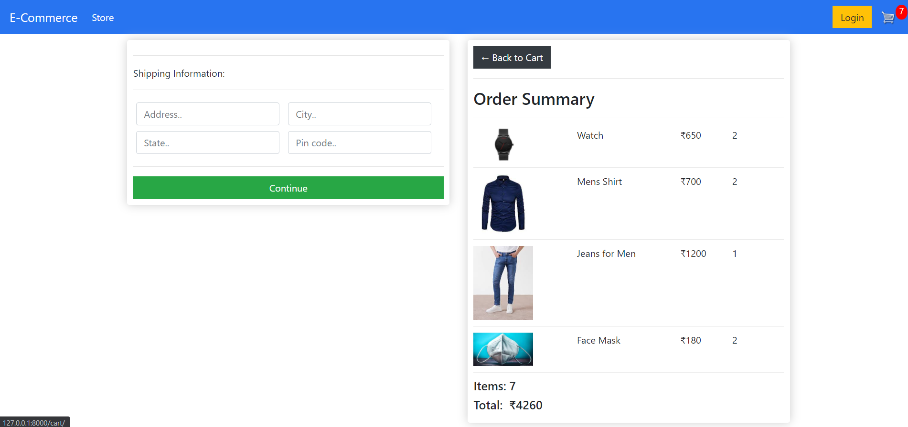

# E-Commerce Website

An e-commerce website using Django where users can shop as a guests or as registered users. 

## Tech Stack

**Frontend:** HTML, CSS, Bootstrap, JavaScript

**Backend:** Django

## Screenshots
1. Home Page (Store)

 

2. Cart Page

3. Checkout Page

